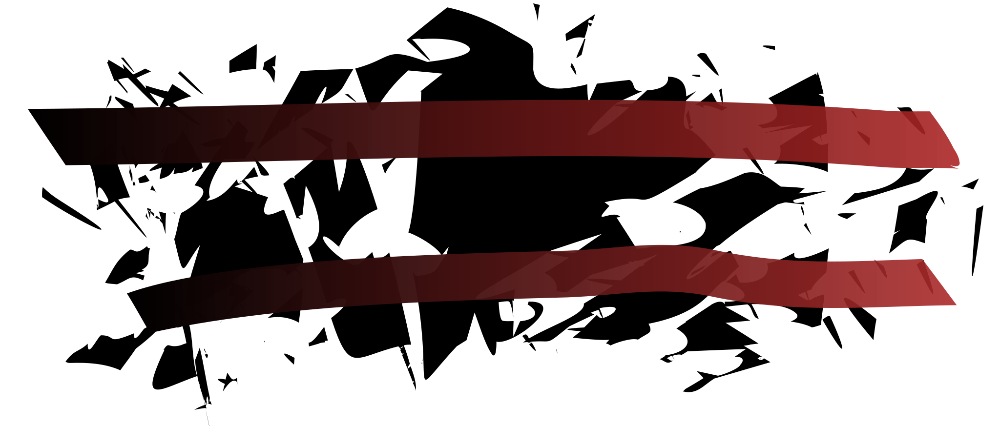
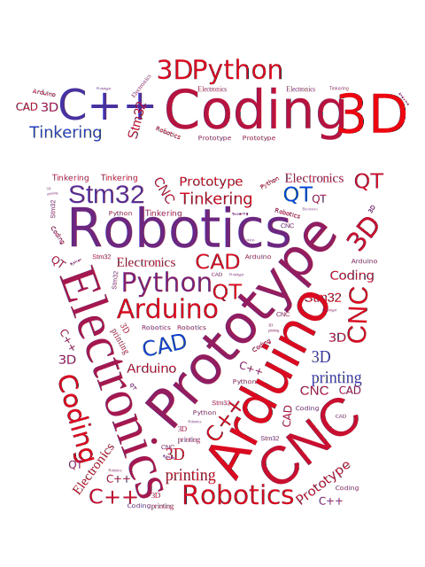

  

 

<h2 align="center"> About Protomosh⚡</h2>

 I'm a Bachelor of Engineering & Information Technology Student.
 Outside school I'm working as process engineer trainee.
 Hobby projects from CAD modeling to prototype manufacturing and ofc coding.
 
 I’m currently working on:
***Uploading local projects to git***
#
- Check out my Project Blog: [Not available yet](https://github.com/protomosh)
 

